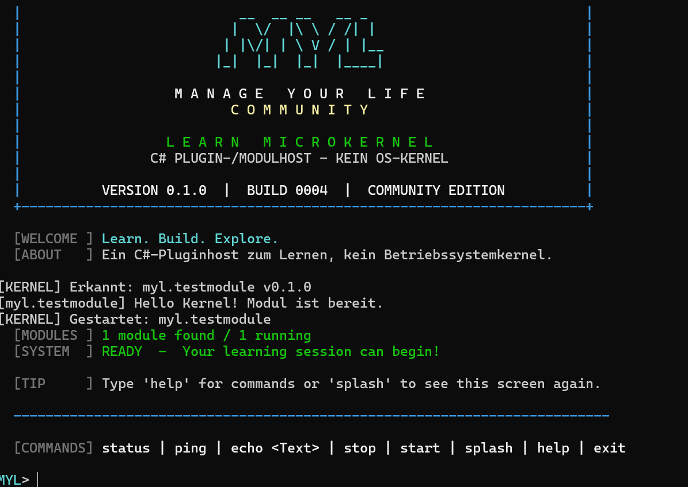

# TaktVibes – Manage Your Life Community Learn Microkernel

**Version 0.1.0 | Build 0008 | Visual Studio 2019 | C# / .NET Framework 4.8**

🇬🇧 [English introduction](README_EN.md) · [Lernheft](LERNEN.md) · [Testplan](TESTPLAN.md) · [MIT-Lizenz](LICENSE) · [Beitrag leisten](CONTRIBUTING.md)

> **Status:** GitHub-Vorbereitung / Release-Kandidat. Ein vollstaendiger VS-2019-Build und alle Tests stehen noch aus. Noch nicht als offizieller Release freigegeben.



*Echter Screenshot des urspruenglichen Community-Designs aus Build 0004. Das Design bleibt erhalten; Build 0008 zeigt entsprechend eine neue Buildnummer.*

Unter der Projektmarke **TaktVibes** zeigen wir mit **Manage Your Life (MYL)** einen einfachen Lern-Microkernel. Das Startbild verwendet wieder das bewährte MYL-Community-Layout aus Build 0004; TaktVibes bleibt im Fenstertitel und in den Projektinformationen sichtbar.

Ein **kleines C#-Lernprojekt fuer ein Plugin- und Modulsystem**: Quellcode anschauen, starten, ausprobieren und Schritt fuer Schritt verstehen. Es ist eine **eigenstaendige Neuimplementierung**, inspiriert von den fruehen Ideen unseres Projekts *Manage Your Life*.

> **WICHTIG: KEIN BETRIEBSSYSTEMKERNEL!** "Learn Microkernel" ist unser Projektname. Technisch ist dies eine **normale Windows-Konsolenanwendung (Plugin-/Modulhost)**, die **C#-DLLs als Plugins** laedt, startet, anspricht und beendet. Sie startet kein Betriebssystem, laeuft nicht im Kernelmodus und steuert keine Hardware.

## Was ist das eigentlich?

- **Host (`MYL.LearnMicrokernel.exe`):** Die Zentrale der Anwendung. Sie sucht Plugins im Ordner `Modules`, startet und verwaltet sie.
- **Plugin / Modul (`MYL.LearnTestModule.dll`):** Eine Erweiterung, die eine klar definierte Schnittstelle umsetzt. Unser Beispiel antwortet auf `PING` mit `PONG`.
- **Contract (`MYL.LearnContract.dll`):** Die gemeinsame Vereinbarung (`IModule`, `IKernelContext`) zwischen Host und Plugin.
- **Kommunikation:** In dieser Version ein **direkter Methodenaufruf im selben Prozess**, also **keine echte IPC** zwischen getrennten Prozessen.

Das System zeigt das **Prinzip einer modularen Plugin-Architektur**. Es ist **weder ein OS-Microkernel** noch ein Windows-Treiber, Bootloader oder Sicherheits-Sandbox. Plugins haben in dieser Lernversion keine Prozessisolation: **Nur eigene oder vertrauenswuerdige DLLs laden.**

## 1. Start in 4 Schritten

1. Unter Windows **Visual Studio 2019** mit **.NET-Desktopentwicklung** installieren. Bei Bedarf das **.NET Framework 4.8 Developer Pack** hinzufuegen.
2. Datei **`MYL.LearnMicrokernel.sln`** in Visual Studio oeffnen.
3. Menue **Erstellen → Projektmappe erstellen** waehlen. Falls erforderlich `MYL.LearnMicrokernel` als **Startprojekt** festlegen.
4. Mit **Strg+F5** starten. Die Community-Startanzeige und die Eingabe **`MYL>`** sollten erscheinen.

Ohne Visual Studio-Oberflaeche: `build.cmd` in der **Developer Command Prompt for VS 2019** und danach `run.cmd` ausfuehren.

## 2. Einfacher Aufbau

```text
MYL_LearnMicrokernel_0.1.0_007/
  MYL.LearnMicrokernel.sln         <- HIER starten
  MYL.LearnMicrokernel/           <- Konsole + Modulhost
    Program.cs                    <- Start und Befehle
    KernelHost.cs                 <- Module laden / starten / stoppen
    StartupScreen.cs              <- farbiges Community-Startbild
  MYL.LearnContract/              <- gemeinsame Schnittstellen
    IModule.cs                    <- was ein Modul koennen muss
    IKernelContext.cs             <- wie ein Modul etwas protokolliert
  MYL.LearnTestModule/            <- unser Testmodul als DLL
    TestModule.cs                 <- Antwortet auf PING und ECHO
  README.md                       <- Einstieg (diese Datei)
  LERNEN.md                       <- Einstieg + vier Mini-Lektionen
  TESTPLAN.md                     <- Testliste
  VERSIONIERUNG.md                <- Regeln fuer Versionen und Buildnummern
  LICENSE                         <- MIT-Lizenz fuer das oeffentliche Lernprojekt
  build.cmd / run.cmd             <- optionaler Build und Start
```

Visual Studio erzeugt beim Build die DLL `MYL.LearnTestModule.dll` im Ausgabeordner `MYL.LearnMicrokernel\bin\Debug\Modules\` (bzw. `Release`). Keine NuGet-Pakete notwendig.

## 3. Was kann Version 0.1.0?

- Gruenes **LEARN MICROKERNEL**-Community-Startbild mit Version und Build-ID.
- Ein Modul im Ordner `Modules` suchen und als DLL laden.
- Testmodul starten und stoppen.
- `PING` senden und `PONG` bekommen, Text mit `ECHO` zuruecksenden.
- Status anzeigen und sauber beenden.

**Befehle:** `help` · `status` · `ping` · `echo Hallo` · `stop` · `start` · `splash` · `exit`.

## 4. So arbeiten die Teile zusammen

```text
                  Console: MYL> ping
                         |
                         v
                  [LearnMicrokernel]
                  Program + KernelHost
                         |
                  gemeinsames IModule
                         |
                         v
                  [LearnTestModule.dll]
                         |
                     Antwort: PONG
```

Die Datei `LERNEN.md` erklaert diese Schritte mit kleinen Aufgaben zum Selbermachen.

## 5. Versionen und Builds

Wie bei unserem groesseren MYL-Projekt werden Versionsnummer und Buildnummer **getrennt** gepflegt. Jeder neue Arbeits-Build bekommt eine neue Buildnummer; bei einem echten Release steigt die Produktversion (siehe `VERSIONIERUNG.md`). Der Stand `0.1.0 Build 0004` bleibt unveraendert eingefroren.

## 6. Projektgrenzen und Freigabe

**Nicht Bestandteil:** Ein Betriebssystemkernel, Windows-Kerneltreiber, Bootloader, Hardwareverwaltung, TaktVibes.Kernel aus dem privaten MYL-Projekt, TKV.OS, TaktBoot, echte IPC, Datenbank, Rechteverwaltung und Sicherheitsmechanismen. Diese Lehrversion verwendet keinen privaten Quellcode. Die Versionsnummer **0.1.0** ist unabhaengig von der privaten Kernel-Versionslinie.

**GitHub-Hinweis:** Dies ist ein vorbereiteter Quellcode-Stand. Der enthaltene oeffentliche Lehrprojekt-Code und die zugehoerige Dokumentation stehen unter der **[MIT-Lizenz](LICENSE)** (Copyright 2026 TaktVibes). Sie erlaubt unter anderem Nutzung, Veraenderung und Weitergabe bei Beibehaltung des Lizenz- und Copyright-Hinweises. **Der private TaktVibes-/MYL-Kernel gehoert nicht zu diesem Repository und wird dadurch nicht lizenziert.** Siehe [GitHub-Veroeffentlichung](GITHUB_RELEASE.md).

**Teststatus:** Quellstruktur/Projektdateien werden statisch geprueft; ein echter Build in Visual Studio 2019 ist in dieser Umgebung nicht moeglich. Darum ist der Laufzeit-Test anhand von `TESTPLAN.md` noch offen. Die GitHub-ZIP enthaelt nur Quellcode und Dokumentation, keine vorkompilierte EXE.
